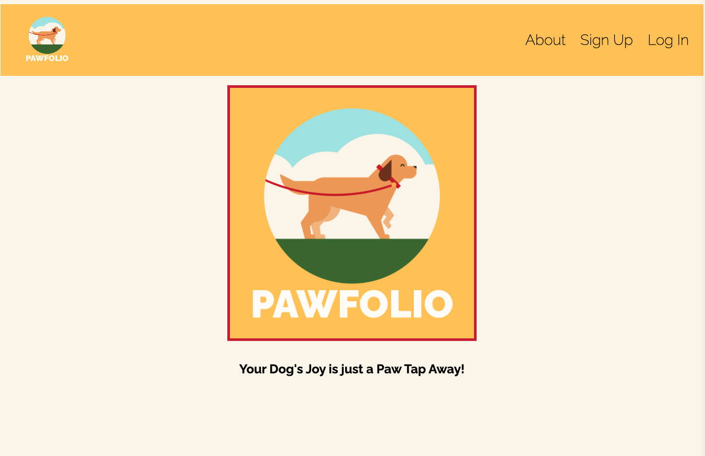
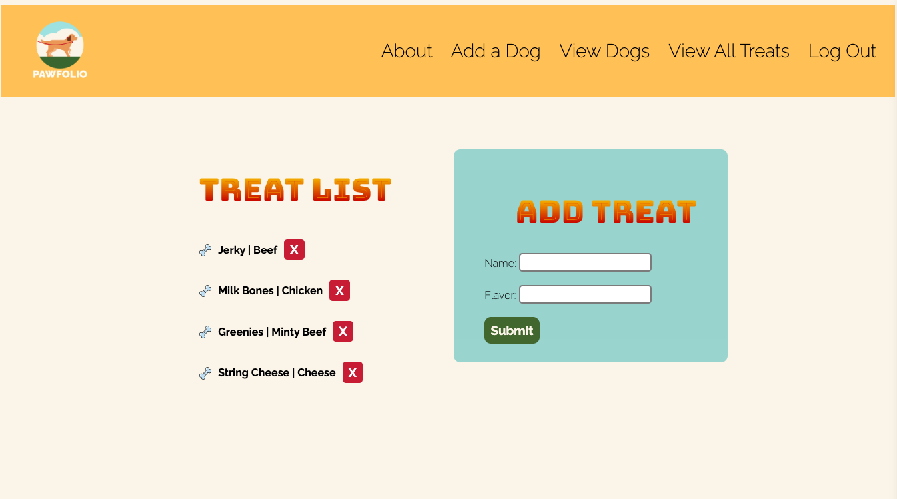
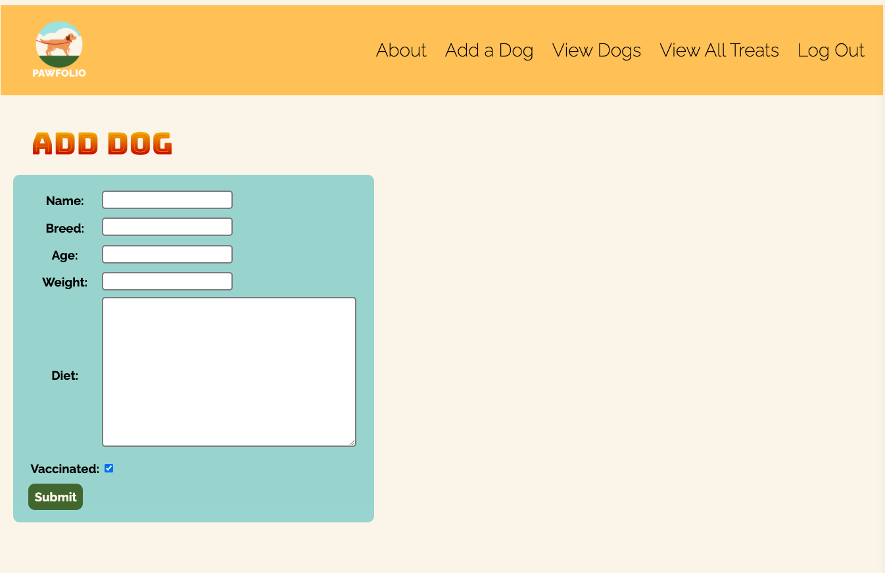
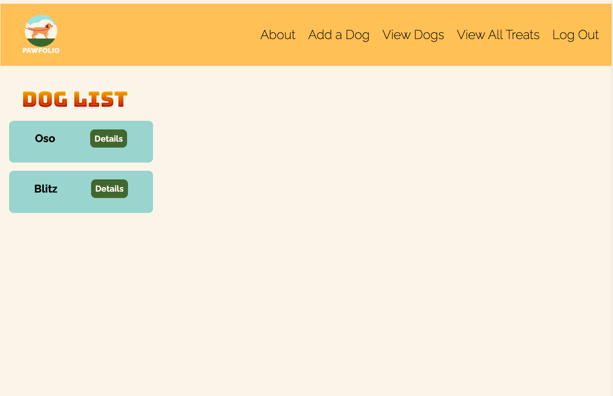
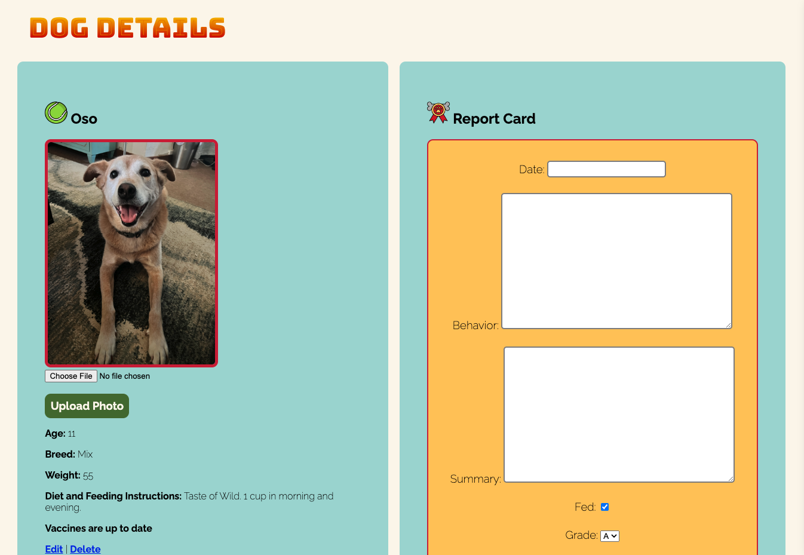
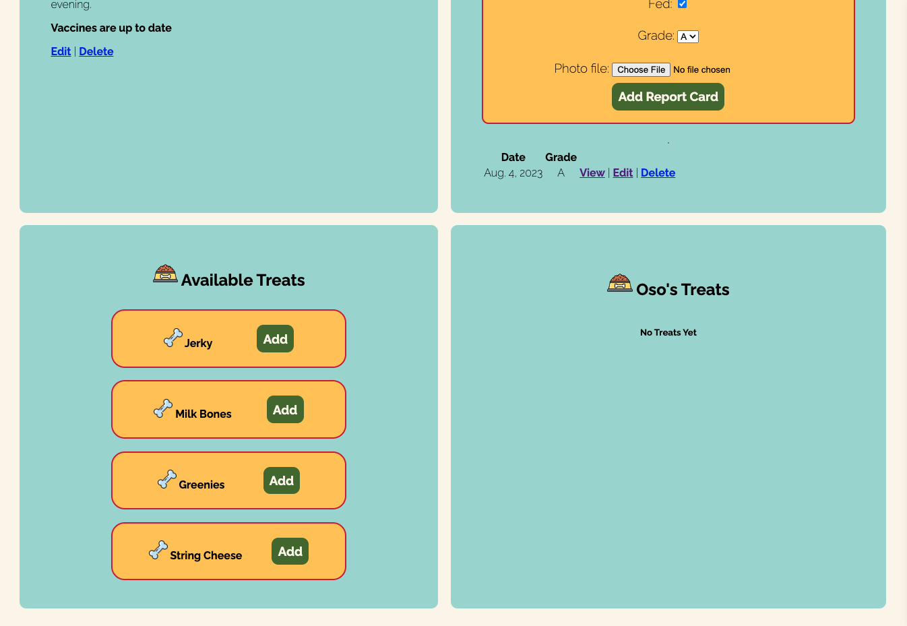
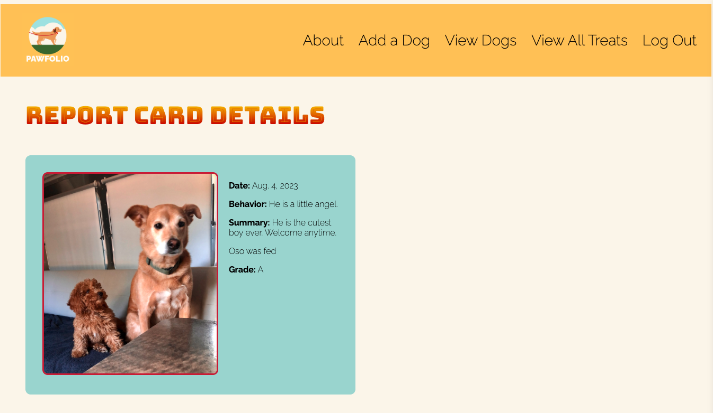

#       PawFolio 🐾

## 🫧 Desription:
Your Dog's Daily Delight! Stay connected with your furry friend through our cutting-edge doggy daycare/boarding app. Get daily reports with adorable photos and updates about your dog's activities, playtime, meals, and more. Never miss a moment of their wagging tail and joyful antics. With PawFolio, your dog's happiness is just a notification away!

## ✨ Features:
- Secure Login/Signup.
- User friendly interface.
- Full functionality across the app!

## 🫧 Preview:
Landing Page:

Add and remove treats:

Add your dog:

View all your dogs:

View your dog's detail page:


View your dog's report card:


## 📌 Technologies Used:


## 🔍 Code Preview:
Model:
```
class Dog(models.Model):
    name = models.CharField(max_length=50)
    age = models.IntegerField()
    breed = models.CharField(max_length=50)
    weight = models.IntegerField()
    diet = models.TextField(max_length=250)
    vaccinated = models.BooleanField(default=True)
    user = models.ForeignKey(User, on_delete=models.CASCADE)
    treats = models.ManyToManyField(Treat)
```
View:
```
@login_required
def dogs_index(request):
    dogs = Dog.objects.filter(user=request.user)
    return render(request, 'dogs/index.html', {
        'dogs' : dogs
    })

@login_required
def dogs_detail(request, dog_id):
    dog = Dog.objects.get(id=dog_id)
    id_list = dog.treats.all().values_list('id')
    treats_dog_doesnt_have = Treat.objects.exclude(id__in=id_list)
    reportcard_form = ReportCardForm()
    return render(request, 'dogs/detail.html', {
        'dog': dog, 'reportcard_form': reportcard_form,
        'treats': treats_dog_doesnt_have
        })

class DogCreate(LoginRequiredMixin, CreateView):
    model = Dog
    fields = ['name', 'breed', 'age', 'weight', 'diet', 'vaccinated']
    
    def form_valid(self, form):
        form.instance.user = self.request.user
        return super().form_valid(form)

class DogUpdate(LoginRequiredMixin, UpdateView):
    model = Dog
    fields = ['breed', 'age', 'weight', 'diet', 'vaccinated']

class DogDelete(LoginRequiredMixin, DeleteView):
    model = Dog
    success_url = '/dogs'
```

## 💫 Getting Started:
Click the link 👉🏼 https://pawfolio-lovelace-7c9477f097c5.herokuapp.com/

## 🔗 Links:
- [Link to Wire Frame](https://www.figma.com/file/CR4TUJh4KyuUc1r1ChQfxY/PawFolio-(Project-3)---Wireframe?type=design&node-id=0-1&mode=design&t=TMH9tKZRPzE8JPi6-0)
- [Link to ERD](https://lucid.app/lucidchart/be884cd1-a7b9-4435-b337-4f915d8637eb/edit?referringApp=slack&shared=true&page=0_0#)

## 🧊 Next Steps and Icebox Items:
- For both the user and admin to be able to see and schedule boarding dates.
- For the user to receive a notification when a new report card is added.
- For the user to receive an image of their dog(s) included in the daily report card.